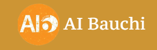

# Welcome to AI Bauchi Community

AI Bauchi is a vibrant AI community based in Bauchi State, Nigeria, committed to promoting the understanding and accessibility of Artificial Intelligence (AI) to all (AI4ALL). Founded by Nathaniel Handan in Oct. 2022, AI Bauchi mission is to empower individuals with the knowledge and skills to harness the potential of AI for personal and professional growth.

## About Us

- **Founder & Current Community Lead:** Nathaniel Handan
- **Location:** Abubakar Tafawa Balewa University, Bauchi, Nigeria

## Our Goals

- Foster a thriving AI ecosystem in Bauchi State.
- Provide accessible AI education and training to the community.
- Create networking opportunities for AI enthusiasts and professionals.
- Promote indigenous AI solutions and innovations.

## What We Offer

- Seminars and Workshops: We regularly organize informative seminars and hands-on workshops on AI fundamentals and applications.
- Training Cohorts: Join our AI training cohorts to dive deeper into AI concepts and gain practical experience.
- Fun Events: We believe learning can be fun! Participate in our AI-themed fun events and challenges.
- Public Speakers: We invite industry experts and thought leaders to share their insights in the field of AI.
- Engaging Community: Connect with like-minded individuals, collaborate on projects, and grow your AI network.

## Join Us

Whether you're a seasoned AI professional or just curious about AI, we welcome you to be a part of our vibrant community. Let's work together to make AI indigenous and accessible to all in Bauchi State!

## Connect with Us
<link rel="stylesheet" href="https://cdnjs.cloudflare.com/ajax/libs/font-awesome/4.7.0/css/font-awesome.min.css">

- [<i class="fa fa-globe" aria-hidden="true"></i> AI Bauchi Official Site](http://aibauchi.com.ng/)
- [<i class="fa fa-twitter" aria-hidden="true"></i> @AIbauchi](https://twitter.com/AIBauchi)
- [<i class="fa fa-linkedin" aria-hidden="true"></i> @AIBauchi](https://www.linkedin.com/company/86812761)
- [<i class="fa fa-envelope" aria-hidden="true"></i> ais.bauchi@gmail,xom](mailto:ais.bauchi@gmail.com)

Feel free to explore our repositories, contribute to our projects, and join the AI Bauchi community on its exciting journey!
